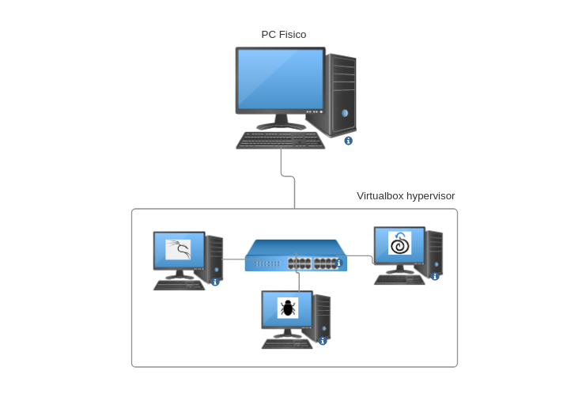

# WeSecure - Lab 0

Bienvenidos a su primer reto, cuyo fin es crear un laboratorio de pruebas para los retos que vendrán en adelante. En este primer reto, vamos a configurar una red de 3 computadores y un `firewall` dentro del `hypervisor Virtualbox`. El esquema de red es el siguiente:

## Requerimientos

- Instalar [Virtualbox](https://www.virtualbox.org/) **Nota:** Esta página está bloqueada en Venezuela, por lo tanto para poder descargar la aplicación se recomienda usar una `VPN` o si lo requieren, alguno de los padrinos puede enviar el instalador según su sistema operativo.
- Se debe crear una red aislada de la red local en la que se encuentra la máquina `host`
- Se deben instalar 3 máquinas virtuales: 
	- [Kali Linux](https://www.kali.org/get-kali/)
	- [Security Onion](https://securityonionsolutions.com/software)
	- [Metasploitable2](https://sourceforge.net/projects/metasploitable/files/Metasploitable2/)
- Estas 3 máquinas deben estar dentro de la red aislada y deben tener comunicación entre sí.
- Actualizar tanto la máquina virtual de Kali y la de Security Onion

## Convenciones

| Distribución   | Nombre | IP Fija |
| -------------- | ------ | ------- |
| Kali           | Red    | Sí      |
| Security Onion | Blue   | Sí      |
| Metasploitable | Bug    | No      |
## Informe

Para este laboratorio **sólo se debe redactar el informe técnico** con capturas de pantalla de: 
- La configuración de la red aislada.
- La configuración IP de cada máquina.
- `ping` entre las máquinas `red` y `blue` y hacía la máquina `bug`.
- El proceso de actualización de la máquina `red` y `blue`.
- Dificultades encontradas en el proceso.
- Cualquier otro detalle técnico que consideren relevante.

## Recursos

- Internet.
- [SecurityOnion essentials](https://youtube.com/playlist?list=PLljFlTO9rB17azL-HwV4BUWUv7Egmcx3T&si=yp2yAIXZiCtHs1JI)
- La clase de `linux` de Tiziano (Pedir por mensaje directo el enlace).
- El foro y los canales de la comunidad.