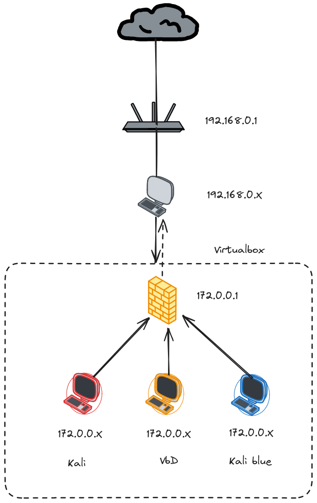

# WeSecure - Lab 0

Bienvenidos a su primer reto, cuyo fin es crear un laboratorio de pruebas para los retos que vendrán en adelante. En este primer reto, vamos a configurar una red de 3 computadores y un `firewall` dentro del `hypervisor Virtualbox`. El esquema de red es el siguiente:

## Requerimientos

- Instalar [Virtualbox](https://www.virtualbox.org/) **Nota:** Esta página está bloqueada en Venezuela, por lo tanto para poder descargar la aplicación se recomienda usar una `VPN` o si lo requieren, alguno de los padrinos puede enviar el instalador según su sistema operativo.
- Se debe crear una red aislada de la red local en la que se encuentra la máquina `host`
- Se deben instalar 4 máquinas virtuales: 
	- [OPNSense](https://opnsense.org/)
	- [Kali Linux](https://www.kali.org/get-kali/)
	- [Kali-purple](https://www.kali.org/get-kali/)
	- [Metasploitable2](https://sourceforge.net/projects/metasploitable/files/Metasploitable2/)
- Estas 4 máquinas deben estar dentro de la red aislada y deben tener comunicación entre sí.
- La máquina que identificaremos como `VdB` debe tener bloqueado el acceso a internet.
- Actualizar tanto la máquina virtual de Kali y Kali-purple.

## Convenciones

| Distribución   | Nombre   | IP Fija |
| -------------- | -------- | ------- |
| OPNSense       | Firewall | Sí      |
| Kali           | Red      | Sí      |
| Kali-Blue      | Blue     | Sí      |
| Metasploitable | VbD      | No      |
## Informe

Para este laboratorio **sólo se debe redactar el informe técnico** con capturas de pantalla de: 
- La configuración de la red aislada.
- La configuración IP de cada máquina.
- `ping` entre las máquinas `red` y `blue` y hacía la máquina `vbd`.
- Realizar un `traceroute` desde la máquina `red` a una dirección de internet y analizar los saltos que hace un paquete para alcanzar el host.
- El proceso de actualización de la máquina `red` y `blue`.
- Dificultades encontradas en el proceso.
- Conclusiones respecto a la creación de la red, la creación del `SOC` y la máquina `red`
- Cualquier otro detalle técnico que consideren relevante.
## Recursos

- Internet.
- [Wiki Kali-blue](https://gitlab.com/kalilinux/kali-purple/documentation/-/wikis/home)
- [Kali-Purple : SOC In A Box Lab Series](https://www.youtube.com/watch?v=-tMY9GVvvsM&list=PLyJqGMYm0vnOxMapUGkt9DfU4aTTU2vqU)
- [The "Real" Kali Purple Install (unedited RAW install footage](https://www.youtube.com/playlist?list=PLrESACtaWMXCveZmAJXoyEZSL26r_bSJR)]
- La clase de `linux` de Tiziano (Pedir por mensaje directo el enlace).
- El foro y los canales de la comunidad.

## Extra
- Leer qué es un `supply chain attack` o `ataque a la cadena de suministro`.
- Leer sobre `vsFTPd 2.3.4`.
- Leer sobre `nmap`.
- Leer sobre `metasploit`.
